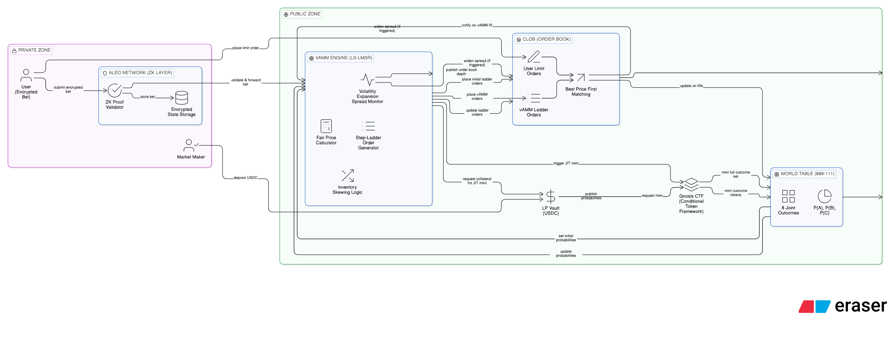

# Private Multi-Dimensional Prediction Market on Aleo

**One-liner:** A zero-knowledge prediction market that pools liquidity across correlated events while keeping all bets completely private — only aggregated prices are public.

---

## Abstract: Why Privacy is Essential for Prediction Markets

As the [Mastering Zcash](https://maxdesalle.com/mastering-zcash/) paper eloquently argues:

> *"Privacy is the right to choose what you reveal and to whom... Surveillance changes behavior — that's one of its primary functions. Sometimes, changing behaviors amounts to constraining ideas, and thus, to constraining progress."*

This applies directly to prediction markets. When every bet is public:
- **Market manipulation becomes easier** — adversaries can study and exploit visible positions
- **Truth-tellers self-censor** — those with real knowledge avoid participating  
- **The surveillance ratchet tightens** — AI will only get better at pattern matching

The paper warns: *"What you do today will be analyzed with the tools of tomorrow. Transactions that seem anonymous now may be trivially traceable in five years."*

### Prediction Markets as Whistleblowing Infrastructure

In a very real sense, **prediction markets are whistleblowing infrastructure**. They allow people with private information to signal truth to the world without directly revealing themselves. A government insider who knows about an impending policy change, a corporate employee who knows about a product failure, a medical researcher who knows about trial results — all can move markets toward truth.

But only if they can do so privately.

Without privacy, prediction markets become just another surveillance tool. With privacy, they become **one of the most powerful mechanisms for revealing truth while protecting truth-tellers**.

> **Privacy for traders, transparency for truth.**

---

## Product Market Fit & Go-To-Market

### Product Market Fit

**Personal Experience:** I use Polymarket extensively — not primarily for gambling, but as a **real-time news verification tool**. When breaking news hits, I check prediction market prices to gauge credibility faster than waiting for mainstream media confirmation. The market aggregates informed opinions instantly.

**The Problem I Experienced:** The more I used Polymarket, the more I realized that complex, multi-outcome events (geopolitics, elections with multiple candidates, correlated market scenarios) suffer from:
1. **Fragmented liquidity** — each outcome trades separately with wide spreads
2. **Easy insider fingerprinting** — sophisticated bettors on unusual combinations are trivially identifiable

**Our PMF:** We solve both problems:
- **Unified liquidity** via joint-outcome AMM — all correlated events share one pool
- **Complete privacy** via Aleo ZK — no one can identify who bet what

### Go-To-Market Strategy

**Why Privacy First, Why Now:**

Privacy is the defining trend in crypto. As surveillance capabilities expand and AI-powered analysis improves, the demand for private financial infrastructure is accelerating:

1. **Regulatory pressure** — OFAC sanctions, KYC requirements make transparent DeFi risky
2. **AI surveillance** — Pattern matching can now identify traders from behavioral signatures
3. **Institutional demand** — Funds cannot use transparent markets without revealing strategies
4. **Whistleblower protection** — The most valuable information comes from insiders who need anonymity

**GTM Phases:**

| Phase | Focus | Target Users |
|-------|-------|--------------|
| **Phase 1** | Privacy-first prediction market on Aleo testnet | Crypto-native privacy advocates, Aleo community |
| **Phase 2** | Multi-dimensional markets (correlated events) | Sophisticated traders, news junkies like me |
| **Phase 3** | Institutional features (selective disclosure, compliance proofs) | Funds, research firms, journalists |

**Competitive Positioning:**
- **vs Polymarket:** We offer privacy (they expose everything)
- **vs Traditional PMs:** We offer multi-dimensional correlated betting (they fragment liquidity)
- **vs Other ZK projects:** We have a clear use case with proven PMF (people already use PMs for news)

---

## System Architecture



---

## The Two Problems

### Problem 1: Transparency Exposes Informed Traders

**Prediction markets are only accurate when informed traders participate.** As Coinbase CEO Brian Armstrong has noted, prediction markets derive their value from attracting people with genuine knowledge about outcomes. Without insiders — those who actually know what's happening — prediction markets become echo chambers of public opinion rather than truth-seeking mechanisms.

But here's the paradox: **transparent blockchains make it trivially easy to identify and expose insiders.**

In traditional prediction markets on transparent chains like Polymarket, sophisticated observers can fingerprint traders by their betting patterns. In multi-dimensional markets, this becomes even easier — betting on specific corners or unusual slices creates a unique signature. Once identified, insiders face:

- **Copy-trading** — their edge disappears as others follow their bets
- **Social/legal exposure** — being linked back to real identity
- **Retaliation** — whistleblowers risk personal safety

This discourages informed traders from participating, which **kills the very mechanism that makes prediction markets valuable**.

### Problem 2: Liquidity Fragmentation

In typical prediction markets, each question is its own market / book:

- Market A: P(A=Yes)
- Market B: P(B=Yes)
- Market C: P(C=Yes)

Even if these events are strongly correlated, liquidity is split across separate pools/orderbooks, leading to:
- Wider spreads (less depth per market)
- Slower price discovery
- Incoherence (prices don't move together unless arbitrage traders manually sync them)

**Incoherent Odds:** Separate markets can imply contradictory "stories of the world." Example: "Event A" jumps to 70%, but "Event B" stays flat even if historically/structurally correlated.

---

## Solution: Two-Part Architecture

### Part 1: Zero-Knowledge Privacy on Aleo

We build on **Aleo** — the only Layer-1 blockchain with **programmable privacy by design**. Using zero-knowledge proofs (specifically zk-SNARKs), we ensure that individual bets remain completely private while the aggregated world table is publicly verifiable.

**Why Aleo?**
- **Offchain Execution** — Compute privately, verify publicly
- **Encrypted State** — User data hidden by default
- **Leo Language** — Developer-friendly ZK smart contracts
- **Mainnet Ready** — Production infrastructure backed by a16z, SoftBank, Samsung

#### How It Works: Private Betting with Public Prices

```
User submits bet (encrypted) → Aleo Network
                                 ├── ZK Proof validates bet is legitimate
                                 ├── AMM updates internal world table
                                 └── Publishes ONLY: new world prices

Public sees: p₀₀₀, p₀₀₁, ... p₁₁₁ (corner prices + derived marginals)
Public does NOT see: who bet, which market, bet size, position
```

**What's Hidden (via ZK Proofs):**
- User identity
- Bet amount
- Which specific outcomes they're betting on
- Their total position and P&L

**What's Public:**
- Aggregated world probabilities
- CLOB order book depth (but not who placed orders)
- Total market volume
- Settlement outcomes

#### Aleo Implementation Details

Our Leo smart contracts implement:

1. **Private Bet Records** — Each bet is stored as an encrypted Aleo record, visible only to the owner
2. **ZK Proof of Valid Bet** — Users prove they have sufficient balance and the bet is valid without revealing details
3. **Commitment-Nullifier Scheme** — Prevents double-spending without linking transactions
4. **Selective Disclosure** — Users can optionally prove their positions for compliance (if required by jurisdiction)

```leo
// Simplified betting structure
record Bet {
    owner: address,
    market_id: field,
    outcome_mask: u8,     // Which corners (hidden)
    amount: u64,          // Bet size (hidden)
    price: u64,           // Execution price (hidden)
}

// Public output: only price updates
transition place_bet(bet: Bet) -> public PriceUpdate {
    // ZK proof validates bet
    // Returns only aggregated price change
}
```

| Property | Benefit |
|----------|---------|
| **Complete bet privacy** | Individual positions are never revealed on-chain |
| **Price transparency** | Full world table and all derived odds are public |
| **Cryptographic integrity** | ZK proofs guarantee AMM computed correctly |
| **Insider protection** | Informed traders can bet without fear of exposure |
| **Whistleblower safety** | Truth-tellers can move markets anonymously |

#### Why ZK Matters for Multi-Dimensional Markets

The more dimensions, the more specific a bet can be — and the easier it is to identify *who* would know that specific combination of outcomes.

Example: If someone bets heavily on "A=Yes, B=Yes, C=No" (world 110) right before news breaks, on a transparent chain they're instantly identifiable. On Aleo, only the price movement is visible — not the trader.

**Zero-knowledge privacy is not just nice-to-have; it's essential to attract the informed capital that makes these markets accurate.**

---

### Part 2: Unified Liquidity via Joint-Outcome AMM

Instead of 3 separate markets, run **one unified source of truth** under the hood:

#### The World Table

For **N binary events**, there are **2^N joint outcomes** ("world states").

For N=3 events A, B, C → 8 worlds:

| World (A,B,C) | Meaning |
|---|---|
| 000 | A no, B no, C no |
| 001 | A no, B no, C yes |
| 010 | A no, B yes, C no |
| 011 | A no, B yes, C yes |
| 100 | A yes, B no, C no |
| 101 | A yes, B no, C yes |
| 110 | A yes, B yes, C no |
| 111 | A yes, B yes, C yes |

The engine maintains probabilities/prices for each world:
- `p000, p001, ... p111`
- All non-negative
- Sum to 1 (probability simplex)

This world table is the **single "source of truth."**

#### Deriving Displayed Odds (Marginals / Slices)

User-facing odds for individual questions are **derived** from the world table.

Example:
- `P(A=Yes) = p100 + p101 + p110 + p111`
- `P(B=Yes) = p010 + p011 + p110 + p111`
- `P(C=Yes) = p001 + p011 + p101 + p111`

So users still see familiar Yes/No markets, but those are *views* of the one joint model.

---

## Betting Types (User-Facing Contracts)

All contracts pay **$1 per share if the contract condition is satisfied**, else $0.

### 1) Marginal (Single Event) — "Normal" Binary Bet
> **A=Yes regardless of B,C**

This is a 1D slice: it groups all worlds where A=1:
- {100,101,110,111}

Payout:
- $1 per share if A resolves Yes
- $0 otherwise

Price:
- `price(A=Yes) = P(A=Yes)` (derived from world table)

### 2) Slice (Partial Multi-Event Bet) — "Ignore One Dimension"
> **A=Yes AND B=Yes, regardless of C**

This is a 2D slice: it groups:
- {110,111}

Payout:
- $1 per share if (A=Yes AND B=Yes)
- $0 otherwise

Price:
- `price(A=Yes,B=Yes) = p110 + p111`

Intuition:
- Slice is easier to win than an exact scenario (more worlds included),
- so it typically costs more per share.

### 3) Corner (Exact Scenario / Absolute Bet)
> **A=Yes, B=Yes, C=No** (world 110)

This is the most specific bet: one exact world.

Payout:
- $1 per share if the final world is exactly 110
- $0 otherwise

Price:
- `price(110) = p110`

Intuition:
- Corner is harder to win (one exact outcome),
- so it's usually cheaper per share.

---

## Why "More Specific = Bigger Upside" (Without Changing Payout Rules)

Payout is always **$1 per share**.  
Your total payout depends on how many shares you bought.

If you spend `$1 USDC`:

- Shares bought = `1 / price`

Example:
- Corner price = $0.10 → you buy 10 shares → win pays $10
- Slice price = $0.20 → you buy 5 shares → win pays $5

So:
- **Corner**: cheaper → more shares → bigger payout if right, but lower hit-rate  
- **Slice**: more expensive → fewer shares → smaller payout, but higher hit-rate

This naturally matches user intuition: precision = higher risk/higher reward.

---

## Why Not Use "1/n payout"?

Scaling payouts by 1/n (e.g., each event pays $1/3) mostly just changes units:
- users will buy 3x shares to get the same exposure
- it does **not** merge liquidity across markets

Liquidity pooling comes from **one shared joint engine**, not from payout scaling.

---

## AMM Design: Active vAMM + LS-LMSR on CLOB

We replace the passive pool model with an **Active Virtual AMM (vAMM)** that acts as a "Robot Market Maker" on a **Central Limit Order Book (CLOB)**.

*See the architecture diagram above for visual reference.*

### Key Components

| Component | Role |
|-----------|------|
| **PRIVATE ZONE (Aleo ZK Layer)** | User submits encrypted bet → ZK Proof validates → Encrypted state storage |
| **Active vAMM Engine** | Fair Price Calculator, Step-Ladder Order Generator, Inventory Skewing, Volatility Spread Monitor |
| **CLOB (Order Book)** | Holds both vAMM ladder orders and user limit orders; Best Price First matching |
| **LP Vault (USDC)** | Collateral pool that funds JIT minting |
| **Gnosis CTF** | Conditional Token Framework for minting outcome token sets |
| **World Table** | 8 joint outcomes (p000...p111) with public aggregated prices |

### Initial Bootstrapping (Market Creation)

Before the vAMM can start quoting, the market must be bootstrapped:

1. **Market Maker deposits USDC** into the LP Vault
2. **Gnosis CTF mints Full Outcome Set** — All outcome tokens (A-H) are created
3. **Tokens sold back to World Table** — Initial prices set (e.g., uniform 1/8 each)
4. **vAMM activates** — Starts calculating fair prices from World Table
5. **vAMM places ladder orders on CLOB** — Market is now live

### CLOB vs vAMM: Coexistence Rules

**Key Principle:** User limit orders and vAMM orders coexist on the CLOB independently. They do NOT interfere with each other unless a trade actually executes.

**Scenario A: User Order Executes First (No vAMM Impact)**
- If a user's price is better than vAMM (e.g., User @ $0.58 vs vAMM @ $0.60)
- User order fills first (Best Price First)
- vAMM price NOT affected, World Table NOT updated

**Scenario B: Trade Hits vAMM (World Table Updates)**
- When a trade matches against vAMM orders:
  1. JIT Minting triggered (LP Vault + Gnosis CTF)
  2. World Table updates (new probabilities)
  3. vAMM recalculates fair price
  4. vAMM places NEW ladder orders on CLOB

**Scenario C: Volatility Expansion Spread (Both Affected)**
- When price moves too fast (e.g., $0.20 → $0.80 in minutes)
- vAMM detects "toxic flow" and widens spread (e.g., Bid @ $0.30, Ask @ $0.70)
- Old vAMM orders cancelled, new wider spread placed
- User orders remain but vAMM liquidity is now further away

| Scenario | vAMM Affected? | CLOB Affected? | World Table Updated? |
|----------|----------------|----------------|----------------------|
| User order fills first | ❌ No | ✅ Order removed | ❌ No |
| vAMM order fills | ✅ Recalculates | ✅ New orders placed | ✅ Yes |
| Volatility Spread triggers | ✅ Widens spread | ✅ vAMM orders change | ❌ No (just spread) |


### 1. The Engine: LS-LMSR (Liquidity-Sensitive)

Standard LMSR has a "static liquidity" bug. We upgrade to **LS-LMSR**:

| Feature | Description |
|---------|-------------|
| **Dynamic Depth** | The liquidity parameter `b` grows with market volume: `b = α × Volume` |
| **Benefit** | The market deepens automatically. "Whales" can trade with lower slippage as the market matures |

### 2. Execution: vAMM vs. User Limit Orders

The vAMM calculates a **"Fair Price"** and places **Limit Orders**. Users can undercut this price. The CLOB always fills the **Best Price First**.

**Example: Trading "Event A"** (vAMM fair value = $0.60)

| Rank | Price | Seller | Status (Who gets filled?) |
|------|-------|--------|---------------------------|
| 1st | $0.58 | User Steve | **Executed First.** (Best Price for Buyer) |
| 2nd | $0.60 | vAMM (Robot) | Executed Second. (Only if Steve runs out) |
| 3rd | $0.65 | User Alice | Executed Third. (Worst Price) |

- **Buying:** Lowest Price wins (User Steve > vAMM)
- **Selling:** Highest Price wins (vAMM > Lowballers)

### 3. Step-Ladder Liquidity (The Iceberg)

The vAMM does **not** place one order for "Infinity Shares." It places a **Ladder of orders** to represent slippage visually:

```
Order 1: 500 shares @ $0.60
Order 2: 500 shares @ $0.61
Order 3: 500 shares @ $0.62
...
```

This allows the CLOB to function normally while accessing the vAMM's infinite depth.

### 4. Just-In-Time (JIT) Minting

When a user trades against the vAMM:

1. User sends USDC
2. vAMM adds its own subsidy (if needed) to complete the $1.00 collateral
3. Gnosis CTF mints the **Full Set** (Outcomes A-H)
4. vAMM gives the User their share (A) and keeps the rest (B-H) in its inventory

### 5. Safety Mechanisms (LP Protection)

To prevent the vAMM from being drained in extreme conditions, we implement three defenses:

#### 5a. Volatility Expansion Spread (Panic Mode)

If the price moves too fast (e.g., jumps from $0.20 to $0.80 in minutes), the vAMM interprets this as "Uninformed/Toxic Flow."

- **Action:** Automatically widens the spread (e.g., Buy @ $0.30, Sell @ $0.70)
- **Result:** Traders must pay a higher fee to trade during panic, compensating LPs for the risk

#### 5b. Inventory Skewing

If the vAMM holds too much of one outcome (e.g., Short "Yes", Long "No"):

- **Action:** Shifts prices to discourage buying Yes and encourage selling Yes
- **Result:** The market naturally re-balances the vAMM's inventory

#### 5c. The Vault Cap (Not Share Cap)

We do **not** cap the number of shares. We cap the **USDC Risk**.

- **Limit:** The vAMM can only mint new shares as long as the LP Vault has funds to pay the subsidy
- **Effect:** If the vault hits $0, the vAMM stops quoting. This guarantees LPs cannot lose more than they deposited

### How Trading a Marginal/Slice Works (Basket Trades)

Users typically trade marginals/slices, not raw corners.

Example: user buys **C=Yes**
- This corresponds to buying a **basket** of world outcomes where C=1:
  - {001,011,101,111}

The vAMM processes this as a multi-outcome trade and updates prices across **all 8 worlds**.
Because the world prices changed, the derived markets (A, B, slices) update too.

---

## Initial Funding / Bootstrapping

### Liquidity Provider (LP) / Market Maker Funding
The LP seeds the market by depositing collateral (e.g., USDC) to back payouts and provide depth.

- LP deposits collateral into the AMM pool (e.g., $10,000 USDC).
- The AMM starts with an initial world-table prior (often uniform or mildly informed).
- As users trade, the AMM updates prices.

The LP does **not** need to "buy all tokens."
Collateral + AMM mechanics are enough to quote and settle.

---

## World Table Calculation Example (Concrete)

### Start: One World Table
Assume N=3. We maintain 8 probabilities that sum to 1:

| World | Prob |
|---|---:|
| 000 | 0.20 |
| 001 | 0.05 |
| 010 | 0.15 |
| 011 | 0.10 |
| 100 | 0.10 |
| 101 | 0.05 |
| 110 | 0.25 |
| 111 | 0.10 |
Sum = 1.00

### Derived Odds (User UI)
- `P(A=Yes) = 100+101+110+111 = 0.10+0.05+0.25+0.10 = 0.50`
- `P(B=Yes) = 010+011+110+111 = 0.15+0.10+0.25+0.10 = 0.60`
- `P(C=Yes) = 001+011+101+111 = 0.05+0.10+0.05+0.10 = 0.30`

### Corner vs Slice Pricing
- Corner (110) price = 0.25  
- Slice (A=Yes,B=Yes regardless of C) price = 110+111 = 0.25+0.10 = 0.35

### $1 Bet Payouts (Per Share $1)
If user spends $1:
- Corner shares = 1/0.25 = 4 → payout $4 if 110 happens
- Slice shares = 1/0.35 ≈ 2.857 → payout ≈ $2.857 if 110 or 111 happens

---

## Benefits

### For Users
- Trade familiar Yes/No markets with deeper liquidity
- Express richer views (scenarios, partial bets) with fewer steps
- Better pricing (tighter spreads, less slippage) due to pooled liquidity
- Coherent cross-market movement (related markets update together)

### For Market Makers / LPs
- One inventory/risk surface instead of fragmented books
- Cleaner hedging via mergeable/splittable exposures (corner ↔ slice ↔ marginal)
- Higher capital efficiency when quoting correlated markets

### For the Platform
- Reduced incoherence and exploitable contradictions across correlated markets
- A scalable framework: N events → 2^N worlds (manageable with small N and can be extended with structured factor models later)

---


## Summary

This design turns multiple correlated prediction markets into a single **multi-dimensional joint-outcome market**, where:
- **the world table is the source of truth**
- **marginals/slices/corners are just different views/contracts**
- **an LMSR AMM updates all prices coherently**
- **liquidity is pooled instead of fragmented**
- **all bets are private via Aleo ZK proofs**

The result is a market that is simpler for users, more capital-efficient for liquidity providers, more consistent overall, and **protects the privacy of informed traders who make markets accurate**.

> We hide individual bets unlike Polymarket, but publish the full world table so anyone can see coherent, aggregated probabilities across all correlated events.

---

## Implementation Details

### 1) Market Clustering Criteria

We combine markets when they share most of:
- **Same domain/driver** (same geopolitical conflict, same company, same macro theme)
- **Similar time window** (or clearly modelable time structure)
- **Non-contradicting resolution sources** (same oracle / same definitions)
- **Expected correlation is strong enough** that shared liquidity helps more than it confuses

#### Context Pipeline (MVP Approach)

For each market question, we extract a structured "context card":

| Field | Examples |
|-------|----------|
| Entities | United States, China, Donald Trump |
| Event type | strike / resignation / sanction / election |
| Region | Middle East, Europe |
| Time window | by [date] |
| Causal theme | escalation / regime change / conflict |

We then compute similarity and group:

**Step A: Similarity Score**
- Text embedding similarity (semantic)
- Overlap in entities
- Overlap in event type
- Overlap in time window

**Step B: Cluster**
- If similarity > threshold → same "cluster"
- Cap cluster size for MVP (3–5 markets)

**Step C: Human/Rules Guardrails**
- Don't combine if time windows differ too much
- Don't combine if resolution criteria differ ("strike" definitions)

This produces market clusters (e.g., "combine these 3 markets") without heavy statistical modeling.

---

### 1b) Initializing Correlation via Naive Bayes

We derive the world table by assuming a **latent "driver" variable** (e.g., `E = escalation level`) that captures the correlation structure.

#### Example Setup

```
E = 0  →  calm
E = 1  →  high escalation

P(E=1) = 0.30

P(A=Yes | E=1) = 0.70,  P(A=Yes | E=0) = 0.10
P(B=Yes | E=1) = 0.60,  P(B=Yes | E=0) = 0.05
P(C=Yes | E=1) = 0.80,  P(C=Yes | E=0) = 0.10
```

#### Naive Bayes Formula (Conditionally Independent Given E)

```
P(A,B,C) = Σₑ P(E=e) · P(A|e) · P(B|e) · P(C|e)
```

This automatically creates a coherent 8-world table that:
- Makes A/B/C **positively correlated** via E
- Provides a reasonable starting "shape"
- Market trades then override and reshape this prior

#### Source of E
- **Context clustering** — markets in the same escalation cluster share the same latent driver
- **Historical learning** — optionally refined over time from market data

> This is a compelling story: we start with a structured prior, then traders move it.

---

### 2) Ensuring Slice Pricing Consistency

We use a single AMM over corners only.

The AMM lives on the **8 corners** (000…111). Marginals and slices are **not separate markets** — they are **basket trades of corners**.

#### Pricing Rules

| Contract Type | Price Formula |
|---------------|---------------|
| Slice (A=1, B=1 regardless of C) | `p₁₁₀ + p₁₁₁` |
| Marginal (C=Yes) | `p₀₀₁ + p₀₁₁ + p₁₀₁ + p₁₁₁` |
| Corner (exact world) | `pᵢⱼₖ` directly |

Users can "trade slices/marginals" in the UI, but the **backend executes as a basket of corner trades** at AMM prices.

**Benefits:**
- ✅ No price mismatch possible
- ✅ No need for merge/split arbitrage logic
- ✅ Much simpler implementation

#### Alternative: Tradeable Slice Tokens (More Complex)

If slices traded directly as separate tokens, merge/split conversion would be required:
- **Merge:** `110 + 111 → slice(AB)`
- **Split:** `slice(AB) → 110 + 111`

If the slice token got overpriced vs corners, arbitrage would sell slice and buy corners.
We avoid this complexity by using corners-only AMM + basket UI.

---

### 3) Position Accounting in Corner-Space

We represent every position internally as **exposure over the 8 corners**.
Cancellation happens automatically by normal addition/subtraction.

#### Internal Accounting Model

We store a portfolio vector `x[000..111]` = how many $1-per-share claims owned on each corner.

| Action | Effect |
|--------|--------|
| Buy corner 110 | `x[110] += 1` |
| Buy slice AB (110+111) | `x[110] += 1, x[111] += 1` |
| Sell corner 111 | `x[111] -= 1` |

#### Example: Automatic Netting

```
User buys slice AB = (110 + 111)
  → x[110] = 1, x[111] = 1

User sells corner 111
  → x[111] -= 1

Net result:
  → x[110] = 1, x[111] = 0
```

The "regardless of C" exposure is **gone** — now it's a pure corner bet on (1,1,0).

Positions are always stored in corner-space, so netting is exact — no manual cancellation needed.

#### UI Display (Merged Positions)

After netting, we compress the display for users:
- If `x[110]` and `x[111]` are both 5 → show **"5 shares of slice(AB)"**
- If only one exists → show corner

This feels magical for users, but it's just algebra on the corner vector.

---

### 4) AMM Scalability

Updating 8 markets per trade is trivial for the machine.

- We run **one AMM** that outputs 8 corner prices
- Marginals/slices are **derived** (sums of corner prices)
- The UI shows a small set; all 8 corners are only shown in "advanced mode"

**Why We Use LMSR:**
- Naturally supports **many outcomes**
- Always produces a **coherent probability distribution** (sums to 1)
- Single update formula handles any basket trade

```
User trades marginal A=Yes
  → AMM updates corners {100, 101, 110, 111}
  → All 8 prices recalculate via softmax
  → All derived marginals/slices update automatically
```

The computational cost is O(2^N) per trade, which is trivial for N ≤ 5 (32 outcomes).
